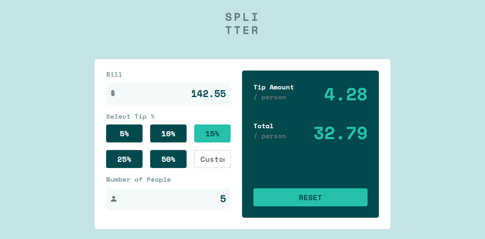
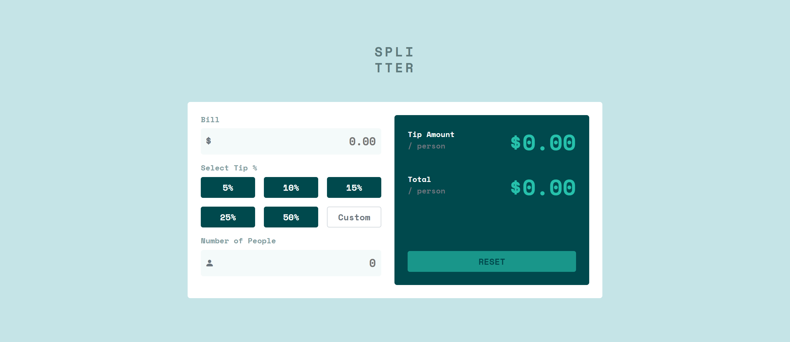
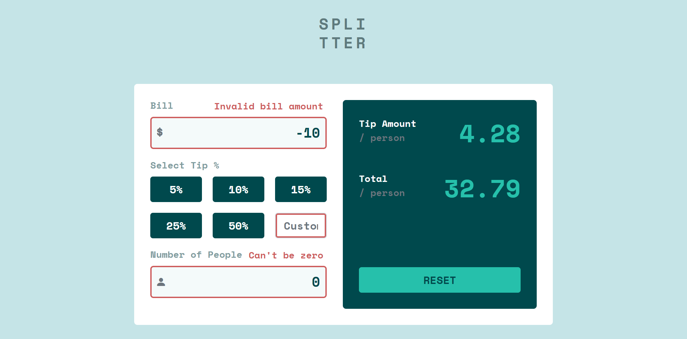
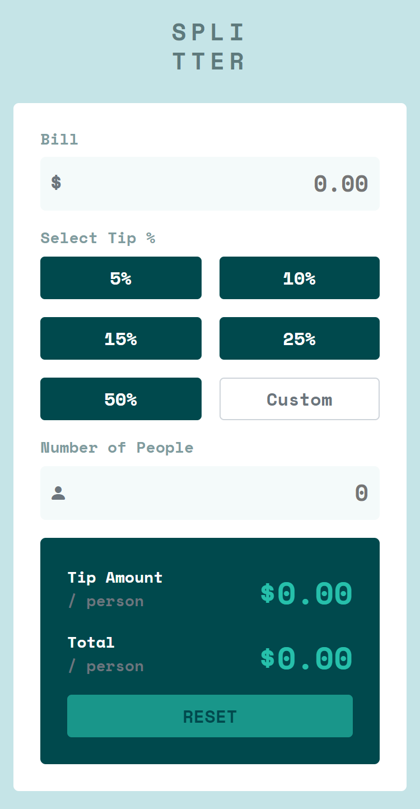
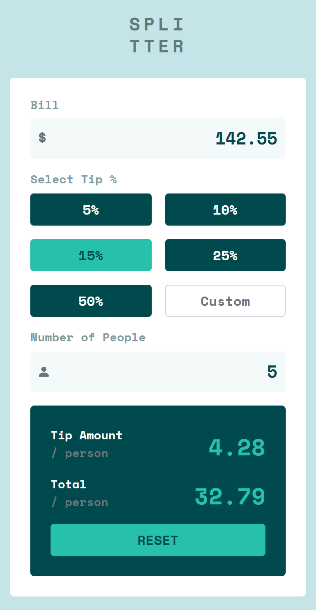

# Frontend Mentor - Tip calculator app solution

This is my solution to the [Tip calculator app challenge on Frontend Mentor](https://www.frontendmentor.io/challenges/tip-calculator-app-ugJNGbJUX). Frontend Mentor challenges help you improve your coding skills by building realistic projects.

**NOTE: I did not have access to the Figma sketch, so the design is far from being pixel perfect.**

## Table of contents

- [Overview](#overview)
  - [Screenshots](#screenshots)
- [My process](#my-process)
  - [Links](#links)
  - [Built with](#built-with)
- [Author](#author)

## Overview

### Screenshots

**Screenshot Desktop Full**

**Screenshot Desktop Empty**

**Screenshot Desktop Error**

**Screenshot Mobile Empty**

**Screenshot Mobile Full**

## My process

### Links

- Live Site URL: [Solution Hosted using GitHub Pages](https://marvin-figueroa.github.io/tip-calculator-app/)

### Built with

- Semantic HTML
- Mobile-First approach
- SASS
- Bootstrap 5
- JavaScript
- Basic DOM Manipulation
- Basic Event Handling

## Author

- Frontend Mentor - [@Marvin-Figueroa](https://www.frontendmentor.io/profile/Marvin-Figueroa)
